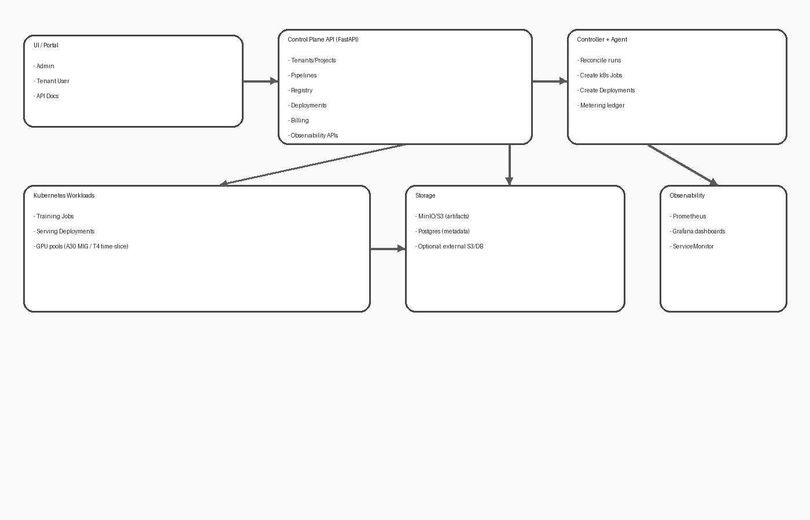
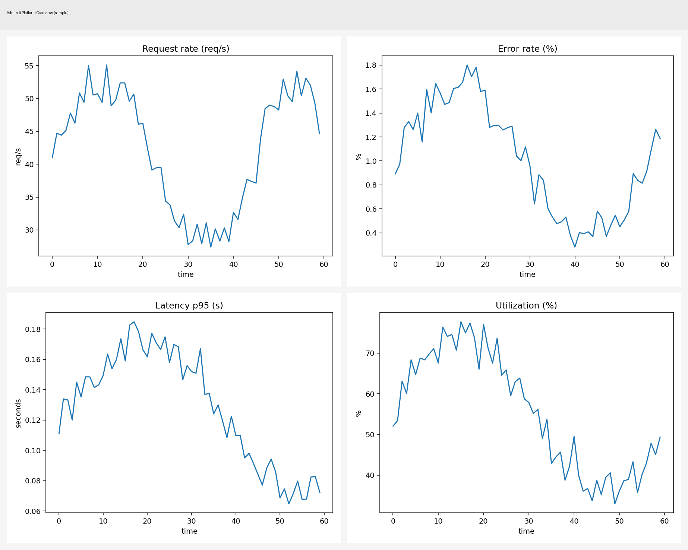
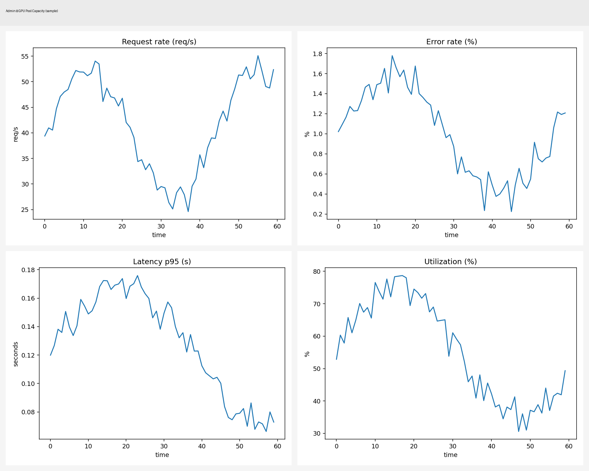

# ModelOps Studio (Demo + Production) — Kubernetes-native ModelOps Platform

This repository is a **complete, end-to-end ModelOps platform** designed for:
- Hosting providers / datacenters (B2B)
- Multi-tenant ML teams (projects, quotas, GPU pools)
- A clean MVP that can be demoed on **kind**, and deployed "for real" on a production Kubernetes cluster.

It includes:
- ✅ Pipelines (templates -> runs)
- ✅ Training jobs (GPU pool selection)
- ✅ Artifacts (MinIO/S3)
- ✅ Model registry (models + versions)
- ✅ Deployments + serving runtime (predict + explain)
- ✅ Monitoring & observability (Prometheus + Grafana dashboards)
- ✅ Metering & billing (usage ledger + invoices)
- ✅ Autoscaling (KEDA for core services, ready to extend to serving)

> Codebase: Python (FastAPI + SQLAlchemy) + Kubernetes API (client) + containerized workloads.

---

## Table of contents
- [Quick start (kind demo)](#quick-start-kind-demo)
- [Production deployment](#production-deployment)
- [Architecture](#architecture)
- [GPU pools: A30 (MIG) + T4 (time-slice)](#gpu-pools-a30-mig--t4-time-slice)
- [Observability (Admin vs User)](#observability-admin-vs-user)
- [Dashboard management APIs](#dashboard-management-apis)
- [API usage examples](#api-usage-examples)
- [Repo layout](#repo-layout)
- [Environment variables](#environment-variables)
- [Limitations & next steps](#limitations--next-steps)

---

## Quick start (kind demo)

### 1) Create kind cluster
```bash
make kind-up
```

### 2) Build images
```bash
make images
```

### 3) Deploy platform (demo mode)
```bash
make deploy
make seed
```

### 4) Run an end-to-end demo flow
```bash
make demo
```

### 5) Port-forward API
```bash
make port-forward
# open: http://localhost:8000/docs
```

---

## Production deployment

> Production mode assumes you have:
> - a real Kubernetes cluster
> - Ingress/DNS (optional)
> - Persistent volumes (PVC)
> - GPU nodes (optional for training/serving)

### 1) Deploy core services
```bash
make prod-deploy NAMESPACE=modelops-system
```

### 2) Install KEDA autoscaling (core services)
```bash
make keda-install
make keda-apply NAMESPACE=modelops-system
```

### 3) Install observability stack + dashboards
```bash
make obs-install
make obs-dashboards
```

---

## Architecture



### Components
- **Control Plane API** (`apps/api`): multi-tenant APIs for projects, pipelines, registry, deployments, billing, dashboards
- **Controller** (`apps/controller`): reconciles pipeline runs and creates Kubernetes Jobs/Deployments
- **Agent** (`apps/agent`): metering & periodic tasks (ledger aggregation ready)
- **Trainer workload** (`apps/workloads/trainer`): training container that writes model artifacts to S3
- **Serving runtime** (`apps/workloads/serving`): runtime container with predict/explain + runtime telemetry

### Storage
- **Postgres**: platform metadata (tenants/projects/registry/ledger)
- **MinIO**: S3-compatible artifact store (models, metrics)

---

## GPU pools: A30 (MIG) + T4 (time-slice)

The platform supports defining GPU pools as **logical capacity**:

- **A30 / MIG pool** (`mode=MIG`): premium isolation & predictable performance
- **T4 / time-slice pool** (`mode=TIME_SLICE`): economical sharing for best-effort workloads

A pool defines:
- node selectors / tolerations
- `capacity_shares` (logical units available)
- `timeslice_replicas` (for time-slice pools)
- `gpu_resource_name` (e.g., `nvidia.com/gpu` or a MIG resource name)

The allocator tracks **PoolAllocations** and exposes pool capacity metrics for dashboards.

---

## Observability (Admin vs User)

This repo implements two monitoring levels:

### Admin dashboards (platform operators)
- Cross-tenant reliability (requests, errors, p95 latency)
- FinOps/cost (rolling 30d derived from the usage ledger)
- Capacity management (GPU pool utilization, pending/running jobs)

Sample screenshots:
- Admin Platform Overview:
  
- Admin GPU Pool Capacity:
  

### User dashboards (tenant teams)
- Per deployment health: request rate, error rate, p95 latency
- Runtime saturation: inflight requests, queue depth, queue wait p95
- Resource usage: CPU & memory (from Kubernetes metrics)

Sample screenshot:
- User Runtime Resources:
  

### Install Prometheus + Grafana + dashboards
```bash
make obs-install
make obs-dashboards
```

---

## Dashboard management APIs

The platform exposes an API for listing, creating, updating, and exporting dashboards.

### Scopes
- `admin`: platform-only dashboards (role=admin)
- `user`: tenant dashboards (global or per tenant)

Endpoints:
- `GET /v1/observability/dashboards?scope=admin|user&tenant_id=<optional>`
- `GET /v1/observability/dashboards/{dashboard_id}`
- `POST /v1/observability/dashboards`
- `PUT /v1/observability/dashboards/{dashboard_id}`
- `DELETE /v1/observability/dashboards/{dashboard_id}`
- `GET /v1/observability/dashboards/{dashboard_id}/export_configmap`

This enables:
- UI-driven dashboard catalog
- tenant-specific dashboards
- GitOps export (ConfigMap YAML for Grafana sidecar)

---

## API usage examples

See full examples in:
- `docs/API_EXAMPLES.md`

Highlights:
- Browse dashboards:
  ```bash
  curl -H 'X-Actor: admin|tenant=platform|role=admin'     'http://localhost:8000/v1/observability/dashboards?scope=admin'
  ```

- Export Grafana ConfigMap YAML:
  ```bash
  curl -H 'X-Actor: admin|tenant=platform|role=admin'     'http://localhost:8000/v1/observability/dashboards/<ID>/export_configmap?namespace=monitoring'
  ```

- Predict:
  ```bash
  curl -X POST -H 'Content-Type: application/json'     -H 'X-Actor: user|tenant=<TENANT_ID>|role=user'     http://localhost:8000/v1/deployments/<DEPLOYMENT_ID>/predict     -d '{"instances":[[0.1,0.2,0.3,0.4]]}'
  ```

---

## Repo layout

- `apps/api` — API container
- `apps/controller` — controller container
- `apps/agent` — agent container
- `apps/workloads/trainer` — training workload
- `apps/workloads/serving` — serving runtime workload
- `src/modelops/*` — shared python packages
- `deploy/modes/kind` — demo deployment
- `deploy/modes/prod` — production deployment
- `deploy/addons/observability` — Prometheus/Grafana + dashboards
- `deploy/addons/keda` — KEDA autoscaling manifests
- `docs/` — documentation and screenshots

---

## Environment variables

Common:
- `DATABASE_URL`
- `S3_ENDPOINT`, `S3_ACCESS_KEY`, `S3_SECRET_KEY`, `S3_BUCKET`
- `MODELOPS_REPO_ROOT` (used to seed built-in dashboards)

Serving runtime:
- `TENANT_ID`, `PROJECT_ID`, `DEPLOYMENT_ID`
- `SERVING_MAX_CONCURRENCY` (controls runtime saturation behavior)
- `SERVING_NVML_ENABLED` (best-effort GPU metrics if NVML exists)

---

## Limitations & next steps

This repo is an MVP designed to be:
- demoable on kind
- clean enough to extend to production

Recommended next steps:
- Replace demo auth with real auth (OIDC / JWT)
- Add OpenTelemetry tracing (gateway -> runtime correlation)
- Add real GPU metrics at node-level with DCGM exporter and join by node/pod
- Extend KEDA autoscaling to scale serving based on traffic (HTTP add-on / Prometheus scaler)
- Add SLOs + alerts + runbooks

---

## License
MIT
