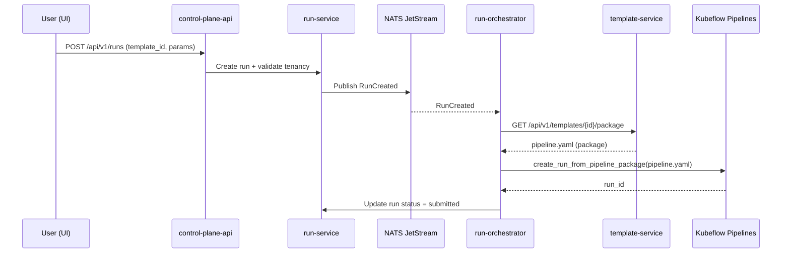

# Architecture (MVP)

This document describes the current MVP architecture and the intended production posture.

## Components

- **control-plane-api (BFF)**: Single public API surface for the platform.
- **Postgres**: Multi-tenant data store (logical tenancy via `tenant_id`/`project_id`).
- **NATS JetStream**: Event bus for async workers.
- **template-service (catalog)**: Ships allowlisted **pipeline YAML packages**; no user code build/compile in-cluster.
- **run-orchestrator**: Consumes run events, fetches pipeline YAML, submits to KFP, updates run status.
- **deployment-worker**: Creates/updates KServe InferenceServices (supports Triton runtime).
- **registry-service + artifact-service**: Model/version metadata + artifact pointers to S3-compatible storage.

## High-level (control plane)

```mermaid
graph TD
  UI[Internal Panel / UI] -->|HTTPS| EDGE[API Gateway (Envoy Gateway) / Edge boundary]
  EDGE -->|tenant-aware routing + identity headers| BFF[control-plane-api]

  BFF --> DB[(Postgres)]
  BFF --> NATS[(NATS JetStream)]

  BFF --> TPL[template-service (catalog)]
  BFF --> REG[registry-service]
  REG --> OBJ[(S3-compatible Artifact Store)]

  subgraph Workers
    RO[run-orchestrator]
    DW[deployment-worker]
    TW[training-worker]
  end

  NATS --> RO
  NATS --> DW
  NATS --> TW

  RO -->|KFP run submission| KFP[Kubeflow Pipelines]
  DW --> KS[KServe]
  KS --> IS[InferenceService]
  IS --> GPU[GPU node pool]
```

## Run lifecycle (YAML-only pipelines)



## Multi-tenancy model

- Envoy Gateway can enforce tenancy by hostname and set `X-Tenant-Id`/`X-Project-Id` via HTTPRoute RequestHeaderModifier filters.


- Request tenancy is identified by headers:
  - `X-Tenant-Id`, `X-Project-Id`
- For demo UX, `control-plane-api` can derive `X-Tenant-Id` from:
  - subdomain: `<tenant>.<TENANT_BASE_DOMAIN>`
  - path prefix: `/t/<tenant>/...`

## Serving and rollout strategies

- Default serving uses KServe `InferenceService`.
- Canary rollout uses `canaryTrafficPercent` (serverless mode).
- Blue/Green can be represented by setting `canaryTrafficPercent=0` then `100` across two rollouts.
- A/B testing can be implemented using `InferenceGraph` in future iterations.

## Security & policy posture (MVP)

- Demo uses `AUTH_MODE=passthrough` (trusted edge assumption).
- Production edge is expected to be handled by the company internal panel.
- Intended hardening layers (can be enabled progressively):
  - image allowlist enforcement (Kyverno)
  - namespace-level isolation (NetworkPolicy + an enforcing CNI)
  - admission controls for workload types/privileges

